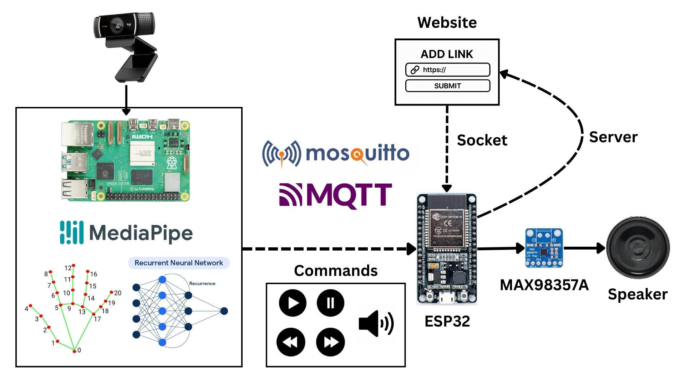

# Nebula: Movement Controlled Audio Player

## Overview

Nebula is an audio player that can be controlled with hand movements using machine learning. It supports basic functions such as next, previous, play/pause, and volume control.

The project is split into two main folders:

- `python-scripts/`: Contains the Python programs used for data collection, model training, and movement classification.
- `esp32/`: A PlatformIO project that runs on the ESP32 to control the audio player.

### `python-scripts/`

- `collect.py`: Collects hand movement dataset via webcam.
- `data.json`: Stores dataset.
- `train_model.ipynb`: Jupyter Notebook for training a machine learning model.
- `classify.py`: Classifies hand movements using the trained model and sends commands via MQTT.
- `my_model.keras`: Pretrained machine learning model.

### `esp32/`

#### `data/`
- `index.html`: Web interface served by the ESP32.
- `style.css`: Stylesheet for the web interface.

#### `lib/`
The audio player logic is split into four main classes:

- `AudioPC.h`: Handles audio control functions.
- `MQTT.h`: Manages MQTT communication between the ESP32 and the broker.
- `WebServerSocket.h`: Manages WebSocket communication between the ESP32 and the web client.
- `Controller.h`: Core controller class that initializes and coordinates all other components.

#### `src/`
- `main.cpp`: Entry point of the ESP32 program.

#### `platformio.ini`
Configuration file for PlatformIO, includes build flags, libraries, and environment settings.


## How It Works



The workflow includes the following steps:

1. A webcam captures hand movement.
2. The MediaPipe Hands library extracts hand landmark coordinates over a series of frames.
3. These frames are processed by a machine learning model to classify the movement.
4. The resulting command is published to a topic via MQTT, using a Mosquitto broker.
5. The ESP32 subscribes to these topics and executes the corresponding action when a command is received.

## Requirements

### Software
- Python
- PlatformIO
- MediaPipe
- OpenCV
- TenserFlow
- Paho-MQTT

### Hardware
- ESP32 
- Webcam
- Speaker
- MAX98357A
- Raspberry Pi

## Steps to Run the Program

1. Clone the Repository
```bash
git clone https://github.com/Argatmj/Nebula.git
cd nebula
```
2. Set Credentials in `platformio.ini`
```bash
cd esp32
``` 
Open the platformio.ini, then locate the build flags section. Set the following build flags with your Wi-Fi and MQTT 
credentials
```ini
build_flags =
    -DWIFI_SSID=\"wifi_ssid\"
    -DWIFI_PASSWORD=\"wifi_password\"
    -DMQTT_IP=\"mqtt_broker_ip\"
``` 

3. Flash the ESP32
```bash
pio run --target upload
```

4. Start Mosquitto Broker
```cmd
net start mosquitto
```
5. Download dependencies 
```bash
cd python-scripts
pip install -r requirements.txt
```

6. Run the movement classifier
```bash
python classify.py
```

## Collecting Dataset
To collect hand movement data for training:

1. Run the collection program
```bash
python collect.py
```

2. Use the following keys:

 - Press **1–9** to set the label for a movement.

 - Press **R** to record the current movement to data.json.

 - Press **D** to delete the last recorded entry.


## Demo
Check out the demo:

[](https://youtu.be/43perHRZqPU)


